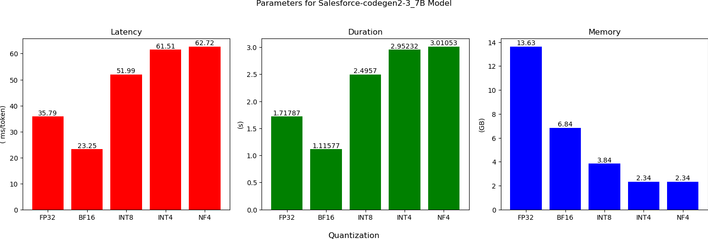

# Comparison of LLM Quantization

# Overview
In this repository, we perform quantization for different models and compute the inference duration, latency, and memory requirements.

# CodeGen Models

For the CodeGen2 models from Salesforce, we used three variants: the 1B model, 3.7B model, and the 7B model

Each model was run for the following quantization data types:
- FP32
- BF16
- INT8
- INT4
- NF4

The results are as follows

  

  

# CodeLlama Models

The 34B model was used.

Since quantization takes a lot of time (and compute), the AWQ- and GPTQ-quantized models (thanks to [TheBloke](https://huggingface.co/TheBloke)) were used.

The results are shown below.

  

We can see that the AWQ model has a slightly better performance than GPTQ.
